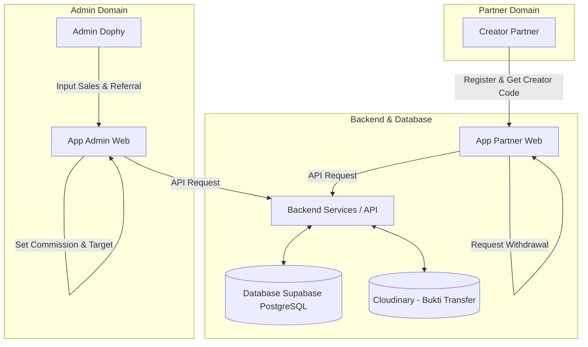
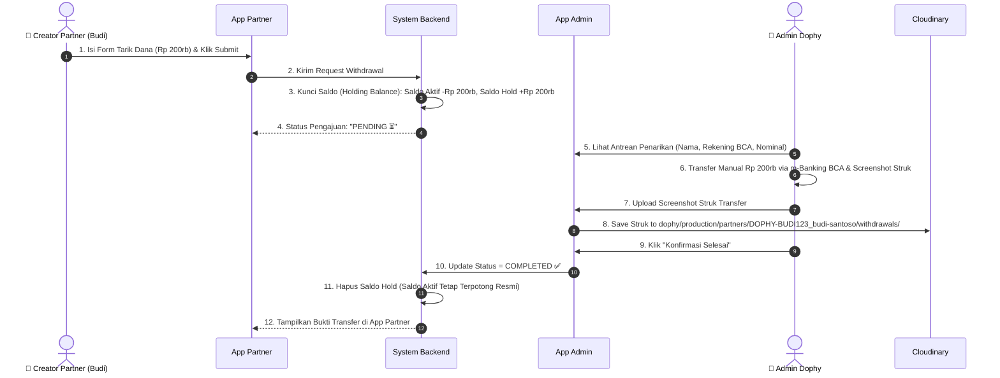

# Review & Analisis Komprehensif: Perancangan Aplikasi Creator Partner DOPHY

**Dokumen Acuan:** [project-plan.md](file:///d:/PROJECT%202026/DOPHY/dophy-code/docs/project-plan.md)  
**Tanggal Review:** September 2026  
**Status:** Approved / Recommended with Enhancements

---

## 1. Ringkasan Eksekutif (Executive Summary)

Dokumen perancangan **Aplikasi Creator Partner DOPHY** ([project-plan.md](file:///d:/PROJECT%202026/DOPHY/dophy-code/docs/project-plan.md)) menyajikan gambaran yang komprehensif mengenai kebutuhan bisnis dan teknis untuk sistem kemitraan dari bisnis snack DOPHY (kemasan 65 gram).

Sistem ini memfasilitasi dua grup pengguna utama: **Admin DOPHY** (pengelola operasional & transaksi) dan **Creator Partner** (mitra pemasar). Dokumen spesifikasi telah mencakup alur bisnis, modul & fitur, skema database, serta batasan sistem secara runtut.

---

## 2. Penjelasan Konsep Bisnis

### Bagaimana Cara Kerja Program Creator Partner DOPHY?

1. **DOPHY** menjual produk snack 65 gr secara langsung ke konsumen (melalui WhatsApp, Chat, atau Toko Fisik).
2. Untuk memperluas jangkauan pembeli, DOPHY bekerja sama dengan **Creator Partner** (mitra promosi).
3. Setiap partner yang terdaftar mendapatkan **Creator Code Unik** (misal: `DOPHY-BUDI123`).
4. Konsumen yang diajak partner akan menyebutkan kode tersebut saat membeli snack ke Admin DOPHY.
5. Admin mencatat penjualan tersebut ke dalam sistem admin. Sistem secara otomatis menghitung Creator Royalty untuk partner pemilik kode.
6. Creator Partner dapat memantau akumulasi royalti mereka melalui smartphone/laptop dan mengajukan penarikan uang (withdrawal) ke rekening bank/e-wallet mereka.

### Pembagian Aplikasi:

- 🏢 **App Admin:** Tempat pengelola Dophy membuat transaksi, mengelola stok, mengatur royalti, mentransfer dana royalti, mengunggah foto bukti transfer, dan menyiarkan pengumuman.
- 📱 **App Partner:** Tempat mitra melihat Creator Code mereka, memantau total royalti & statistik pembeli, melihat progres target, serta mengajukan penarikan dana.

> 🔒 **Keamanan Privasi:** Creator Partner **hanya melihat statistik total** (jumlah pembeli & total royalti) tanpa bisa melihat nama, nomor WhatsApp, atau alamat pembeli. Data pembeli sepenuhnya rahasia di tangan Admin.

---

## 3. Analisis Komprehensif Arsitektur Sistem

Sistem ini didesain sebagai **Monorepo / Multi-App Architecture** berbasis Web yang responsif (dapat diakses nyaman dari Mobile & Desktop).



### Fitur Utama Berdasarkan Modul:

#### A. App Admin (Operational Hub)

- **Dashboard Analytics:** Visualisasi total omset, royalti terutang, total partner aktif, dan alert stok.
- **Katalog & Inventory Management:** Pencatatan varian rasa, harga, dan kalkulasi mutasi stok.
- **Transaction Engine (Sales Entry):** Formulir pencatatan penjualan manual beserta pencocokan otomatis Creator Code.
- **Partner & Target Management:** Penetapan kuota/target bulanan per partner, suspen/aktifkan akun.
- **Payout Approval & Bukti Transfer:** Manajemen antrean pencairan dana, validasi nominal, unggah bukti bayar.
- **Broadcast Announcement:** Fitur berita/pengumuman internal yang langsung tampil di dashboard partner.

#### B. App Partner (Partner Portal)

- **Instant Creator Code Generator:** Pembuatan otomatis Creator Code saat pendaftaran sukses.
- **Real-Time Financial Dashboard:** Tampilan saldo tersedia (_available balance_), saldo tertahan (_held balance_), dan total pencairan.
- **Privacy-Safe Performance Summary:** Tampilan jumlah transaksi tanpa membuka identitas pembeli.
- **Withdrawal Portal:** Formulir pengajuan penarikan dana langsung ke rekening bank/e-wallet terdaftar.
- **Audit & Receipt Viewer:** Histori penarikan dana dilengkapi lampiran bukti transfer dari admin.

---

## 4. Analisis Mendalam Logika Bisnis Kritis (Core Business Rules)

### 4.1 Logika Saldo & Penarikan Dana (Withdrawal & Balance Hold)

#### Flow Saldo Penarikan:

1. **Kondisi Awal:** Saldo Aktif = Rp 500.000, Saldo Tertahan = Rp 0.
2. **Partner Submit Penarikan (Rp 200.000):**
   - Backend langsung mengubah:
     - `Saldo Aktif` = Rp 300.000
     - `Saldo Tertahan` = Rp 200.000
   - Dibuat record di tabel `withdrawals` dengan status `pending`.
   - _Tujuan:_ Mencegah partner menekan tombol tarik dana berkali-kali secara bersamaan (_double withdrawal vulnerability_).
3. **Skenario A - Admin Menyetujui & Transfer Selesai:**
   - Admin upload bukti transfer dan ubah status menjadi `completed`.
   - `Saldo Tertahan` berkurang Rp 200.000 menjadi Rp 0. `Saldo Aktif` tetap Rp 300.000.
4. **Skenario B - Admin Menolak Pengajuan:**
   - Admin memasukkan alasan (misal: "Nomor rekening tidak aktif") dan ubah status menjadi `rejected`.
   - System **Rollback**: `Saldo Aktif` bertambah kembali Rp 200.000 (menjadi Rp 500.000), `Saldo Tertahan` menjadi Rp 0.

### 4.2 Logika Perhitungan Creator Royalty

- Royalti dihitung **server-side** saat admin men-submit transaksi penjualan baru.
- Rumus komisi/royalti:
  $$\text{Creator Royalty} = \text{Jumlah Pcs} \times \text{Nominal Royalti Per Pcs}$$

---

## 5. Review Skema Database

```
[admins] 1 ──── N [sales]
[admins] 1 ──── N [announcements]

[partners] 1 ──── N [sales]
[partners] 1 ──── N [commissions]
[partners] 1 ──── N [withdrawals]

[products] 1 ──── N [sales]
```

### Integrasi Cloudinary & Standarisasi Subfolder per Partner

Penanganan file bukti transfer, nota transaksi, dan foto produk diintegrasikan dengan **Cloudinary**. Struktur folder dibuat terorganisir:

```text
dophy/
└── {env}/                                    # production | staging | development
    ├── products/                             # Foto produk & varian snack
    ├── announcements/                        # Banner/gambar pengumuman admin
    └── partners/                             # ROOT FOLDER SELURUH CREATOR PARTNER
        └── {referral_code}_{nama_slug}/      # SUBFOLDER KHUSUS PER PARTNER
            ├── withdrawals/                  # Bukti transfer penarikan dana partner ini
            └── sales-receipts/               # Nota transaksi penjualan milik partner ini
```

---

## 6. Detail Alur Kerja Penarikan Dana


