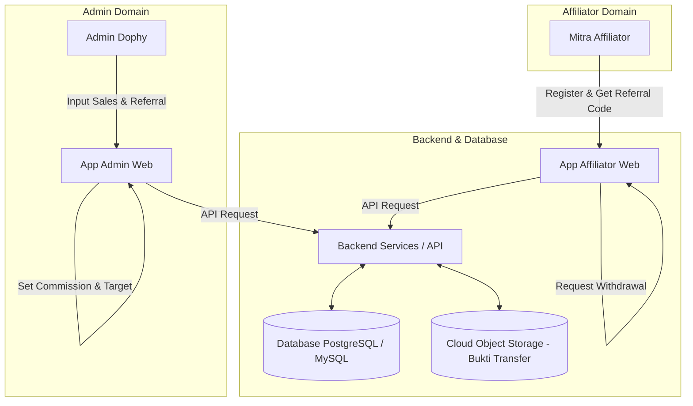

# Review & Analisis Komprehensif: Perancangan Aplikasi Affiliate DOPHY

**Dokumen Acuan:** [project-plan.md](file:///d:/PROJECT%202026/DOPHY/dophy-code/docs/project-plan.md)  
**Tanggal Review:** September 2026  
**Status:** Approved / Recommended with Enhancements  

---

## 1. Ringkasan Eksekutif (Executive Summary)

Dokumen perancangan **Aplikasi Affiliate DOPHY** ([project-plan.md](file:///d:/PROJECT%202026/DOPHY/dophy-code/docs/project-plan.md)) menyajikan gambaran yang sangat baik mengenai kebutuhan bisnis dan teknis untuk sistem pemasaran berbasis affiliate dari bisnis snack DOPHY (kemasan 65 gram).

Sistem ini memfasilitasi dua grup pengguna utama: **Admin DOPHY** (pengelola operasional & transaksi) dan **Affiliator** (mitra pemasar). Dokumen spesifikasi asli telah mencakup alur bisnis, modul & fitur, skema database awal, serta batasan sistem secara runtut. 

Review ini bertujuan untuk membedah perencanaan tersebut secara mendalam, menilai ketahanan logika teknisnya, mengidentifikasi celah potensial, serta memberikan rekomendasi improvisasi praktis bagi tim pengembang.

---

## 2. Penjelasan Konsep Bisnis (Bahasa Sederhana)

### Bagaimana Cara Kerja Pemasaran Affiliate DOPHY?
1. **DOPHY** menjual produk snack 65 gr secara langsung ke konsumen (melalui WhatsApp, Chat, atau Toko Fisik).
2. Untuk memperluas jangkauan pembeli, DOPHY bekerja sama dengan **Affiliator** (mitra promosi).
3. Setiap affiliator yang terdaftar mendapatkan **Kode Referral Unik** (misal: `DOPHY-BUDI123`).
4. Konsumen yang diajak affiliator akan menyebutkan kode tersebut saat membeli snack ke Admin DOPHY.
5. Admin mencatat penjualan tersebut ke dalam sistem admin. Sistem secara otomatis menghitung komisi untuk affiliator pemilik kode.
6. Affiliator dapat memantau akumulasi komisi mereka melalui smartphone/laptop dan mengajukan penarikan uang (withdrawal) ke rekening bank/e-wallet mereka.

### Pembagian Aplikasi:
- 🏢 **App Admin:** Tempat pengelola Dophy menginput penjualan, mengelola stok, mengatur komisi, mentransfer uang komisi, mengunggah foto bukti transfer, dan menyiarkan pengumuman.
- 📱 **App Affiliator:** Tempat mitra melihat kode referral mereka, memantau total komisi & statistik pembeli, melihat progres target, serta mengajukan penarikan dana.

> 🔒 **Keamanan Privasi:** Affiliator **hanya melihat statistik total** (jumlah pembeli & total komisi) tanpa bisa melihat nama, nomor WhatsApp, atau alamat pembeli. Data pembeli sepenuhnya rahasia di tangan Admin.

---

## 3. Analisis Komprehensif Arsitektur Sistem

Sistem ini didesain sebagai **Monorepo / Multi-App Architecture** berbasis Web yang responsif (dapat diakses nyaman dari Mobile & Desktop).



### Fitur Utama Berdasarkan Modul:

#### A. App Admin (Operational Hub)
- **Dashboard Analytics:** Visualisasi total omset, komisi terutang (*unpaid commission*), total affiliator aktif, dan *stok alert*.
- **Katalog & Inventory Management:** Pencatatan varian rasa, harga, dan kalkulasi mutasi stok.
- **Transaction Engine (Sales Entry):** Formulir pencatatan penjualan manual beserta pencocokan otomatis kode referral.
- **Affiliator & Target Management:** Penetapan kuota/target bulanan per affiliator, suspen/aktifkan akun.
- **Payout Approval & Bukti Transfer:** Manajemen antrean pencairan dana, validasi nominal, unggah bukti bayar (gambar/PDF).
- **Broadcast Announcement:** Fitur berita/pengumuman internal yang langsung tampil di dashboard affiliator.

#### B. App Affiliator (Partner Portal)
- **Instant Referral Generator:** Pembuatan otomatis kode referral saat pendaftaran sukses.
- **Real-Time Financial Dashboard:** Tampilan saldo tersedia (*available balance*), saldo tertahan (*held balance*), dan total pencairan.
- **Privacy-Safe Performance Summary:** Tampilan jumlah transaksi tanpa membuka identitas pembeli.
- **Withdrawal Portal:** Formulir pengajuan penarikan dana langsung ke rekening bank/e-wallet terdaftar.
- **Audit & Receipt Viewer:** Histori penarikan dana dilengkapi lampiran bukti transfer dari admin.

---

## 4. Analisis Mendalam Logika Bisnis Kritis (Core Business Rules)

### 4.1 Logika Saldo & Penarikan Dana (Withdrawal & Balance Hold)
Salah satu poin paling krusial pada **Poin 7.3 `project-plan.md`** adalah penanganan **Hold Saldo**. 

#### Flow Saldo Penarikan:
1. **Kondisi Awal:** Saldo Aktif = Rp 500.000, Saldo Tertahan = Rp 0.
2. **Affiliator Submit Penarikan (Rp 200.000):**
   - Backend langsung mengubah:
     - `Saldo Aktif` = Rp 300.000
     - `Saldo Tertahan` = Rp 200.000
   - Dibuat record di tabel `withdrawals` dengan status `diajukan`.
   - *Tujuan:* Mencegah affiliator menekan tombol tarik dana berkali-kali secara bersamaan (*double withdrawal vulnerability*).
3. **Skenario A - Admin Menyetujui & Transfer Selesai:**
   - Admin upload bukti transfer dan ubah status menjadi `selesai`.
   - `Saldo Tertahan` berkurang Rp 200.000 menjadi Rp 0. `Saldo Aktif` tetap Rp 300.000.
4. **Skenario B - Admin Menolak Pengajuan:**
   - Admin memasukkan alasan (misal: "Nomor rekening tidak aktif") dan ubah status menjadi `ditolak`.
   - System **Rollback**: `Saldo Aktif` bertambah kembali Rp 200.000 (menjadi Rp 500.000), `Saldo Tertahan` menjadi Rp 0.

### 4.2 Logika Perhitungan Komisi (Commission Engine)
- Komisi dihitung **server-side** saat admin men-submit transaksi penjualan baru.
- Rumus komisi fleksibel:
  $$\text{Komisi Transaksi} = \text{Jumlah Pcs} \times \text{Nominal Komisi Per Pcs}$$
  *Atau*
  $$\text{Komisi Transaksi} = \text{Total Harga Sales} \times \text{Persentase Komisi (\%)}$$

---

## 5. Review & Evaluasi Skema Database (Database Schema Review)

Skema database pada **Bagian 8 `project-plan.md`** sudah mencakup 7 tabel utama. Berikut adalah evaluasi teknis dan rekomendasi indeks/constraint:

```
[admins] 1 ──── N [sales]
[admins] 1 ──── N [announcements]

[affiliators] 1 ──── N [sales] (via kode_referral)
[affiliators] 1 ──── N [commissions]
[affiliators] 1 ──── N [withdrawals]

[products] 1 ──── N [sales]
```

### Rekomendasi Penyempurnaan Field & Indeks Database:

1. **Tabel `affiliators`:**
   - Tambahkan `INDEX` pada `kode_referral` dengan aturan `UNIQUE`. Ini menjamin tidak ada dua affiliator dengan kode yang sama di tingkat database.
   - Tambahkan field `saldo_tersedia` (decimal) dan `saldo_tertahan` (decimal) jika ingin performa read dashboard lebih cepat dibanding melakukan query `SUM()` berulang kali.

2. **Tabel `sales`:**
   - Tambahkan `INDEX` pada `kode_referral_digunakan` dan `tanggal_transaksi` untuk mempercepat query laporan bulanan.
   - Tambahkan field `status_komisi` (enum: `calculated`, `voided`) jika transaksi dibatalkan oleh admin.

3. **Tabel `withdrawals`:**
   - Pastikan field `status` menggunakan ENUM: `'diajukan'`, `'diproses'`, `'selesai'`, `'ditolak'`.
   - Catat `disetujui_oleh` (FK -> admins) untuk kebutuhan audit trail internal.

---

## 6. Evaluasi Kelebihan, Celah (Gap Analysis), & Matriks Risiko

### Matriks Analisis Potensi Risiko (Risk Assessment):

| Kategori Risiko | Masalah Potensial | Tingkat Risiko | Solusi Mitigasi |
|---|---|---|---|
| **Human Error** | Admin salah mengetik Kode Referral saat transaksi manual. | **Tinggi** | Gunakan komponen UI **Autocomplete Select** dengan pencarian otomatis nama/kode affiliator. |
| **Operational Bottleneck** | Pesanan harian meledak, admin kewalahan input transaksi satu per satu. | **Sedang** | Sediakan fitur **Import Batch Sales via Excel/CSV** di App Admin. |
| **Concurrency / Double Claim** | Affiliator melakukan klik ganda (double click) pada tombol submit withdrawal. | **Tinggi** | Implementasikan **Database Transaction Isolation (SERIALIZABLE/FOR UPDATE)** & Rate Limiting di API backend. |
| **Storage & Bandwidth** | File bukti transfer berukuran besar memenuhi disk server. | **Rendah** | Implementasikan kompresi gambar otomatis di client/server dan upload ke Cloud Object Storage. |
| **Sengketa Komisi** | Perubahan skema komisi mendadak menimbulkan ketidakcocokan komisi lama vs baru. | **Sedang** | Nilai komisi disimpan secara **snapshot** pada tabel `sales` / `commissions` pada saat transaksi terjadi. |

---

## 7. Rekomendasi Fitur Tambahan (Recommended Enhancements)

Untuk menjadikan aplikasi ini semakin robust dan siap dipakai dalam skala lebih besar, berikut rekomendasi fitur tambahan:

### 1. Smart Autocomplete & Quick Lookup pada Input Admin
Saat Admin menginput transaksi, admin cukup mengetik 2-3 huruf kode/nama affiliator. Sistem akan menampilkan daftar opsi yang valid beserta foto/kontak affiliator untuk memastikan tidak ada kesalahan input.

### 2. Snapshots Komisi pada Setiap Transaksi
Nilai rupiah komisi dihitung dan disimpan langsung (*hardcoded snapshot*) di tabel `sales.komisi_dihasilkan` pada detik transaksi dibuat. Dengan demikian, jika admin mengubah aturan komisi global di masa depan, transaksi historis tidak akan mengalami pembengkakan/perubahan nilai komisi.

### 3. Integrasi Media Storage (Cloudflare R2 / AWS S3 / Supabase Storage)
Penanganan file bukti transfer disarankan menggunakan layanan Object Storage eksternal agar backend tidak terbebani oleh penyimpanan statis gambar.

### 4. Direct WhatsApp Notification (Opsional / Nice-to-Have)
Mengirimkan notifikasi WhatsApp otomatis ke Affiliator ketika:
- Pengajuan penarikan dana mereka telah berhasil dicairkan (disertai link bukti transfer).
- Ada pengumuman promo penting dari admin.

---

## 8. Panduan Langkah Implementasi Developer (Development Roadmap)

Berikut adalah urutan pengerjaan yang disarankan untuk tim programmer:

### Fase 1: Core Database & Authentication (Minggu 1)
- Setup database PostgreSQL / MySQL dengan skema & constraint unik.
- Implementasi autentikasi terpisah (JWT / Session) untuk Role Admin dan Role Affiliator.
- Halaman Register & Auto-generate Kode Referral Unik.

### Fase 2: Admin Operations & Product Management (Minggu 2)
- CRUD Produk & Stok di App Admin.
- Form Input Sales Manual + Engine Perhitungan Komisi Server-Side.
- Tampilan Rekap Penjualan & Daftar Affiliator.

### Fase 3: Withdrawal Engine & Hold Balance Logic (Minggu 3)
- Implementasi Form Withdrawal di App Affiliator.
- Backend Logic: Atomic Balance Hold & Rollback Mechanism.
- Panel Persetujuan Transfer + Upload Bukti Transfer di App Admin.

### Fase 4: Dashboard Analytics, Announcements & Polishing (Minggu 4)
- Tampilan statistik & progres target di App Affiliator.
- Fitur Pengumuman / Broadcast Admin.
- Responsive Testing (Mobile UI untuk Affiliator, Desktop UI untuk Admin).
- End-to-End Security Audit & Testing.

---

## 9. Kesimpulan Final Review

Spesifikasi dalam [project-plan.md](file:///d:/PROJECT%202026/DOPHY/dophy-code/docs/project-plan.md) sudah **sangat solid, terstruktur, dan realistis** untuk diimplementasikan. Solusi yang ditawarkan sesuai dengan kebutuhan operasional DOPHY saat ini. 

Dengan menerapkan rekomendasi pada dokumen review ini—terutama pada aspek **keamanan transaksi saldo (atomic hold/rollback)** dan **improvisasi UI input admin**—aplikasi ini akan siap menangani ribuan transaksi dan ratusan affiliator dengan aman, efisien, dan transparan.
